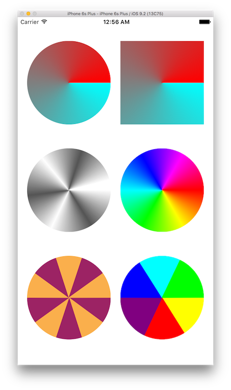
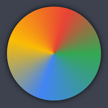

#XHAngleGradientLayer
---
  

**XHAngleGradientLayer** is a **CALayer** implementation of angle gradient. And this is the Swift version of the original **[AngleGradientLayer](https://github.com/paiv/AngleGradientLayer)** built by *[paiv](https://github.com/paiv)* in Objective-C. 

##Demo  
  
  

##Usage
###Use XHAngleGradientLayer.swift

```swift
class CustomView: UIView {
    override class func layerClass() -> AnyClass {
        return AngleGradientLayer.self
    }

    override init(frame: CGRect) {
        super.init(frame: frame)

        let l: XHAngleGradientLayer = self.layer as! XHAngleGradientLayer
        l.colors = [] // setup custom colors
        l.locations = [] // setup custom locations
    }
}
```

###Use XHAngleGradientView.swift
For conveniece, I have made a **UIView** component which can be directly used. And there are two shapes can be chosen when initialting the view - **.Rect** and **.Oval**.  

```swift
let customView = XHAngleGradientView(frame: CGRect, withColors colors: [UIColor], withLocations locations: [Double], shape: Shape)
```
Also the other properties of the **XHAngleGradientLayer** can be modified as normal **CALayer**. For example:  

```swift
customView.layer.cornerRadius = 5.0
```   

###Some examples on colors and locations
####About colors property
```swift
internal var colors = [UIColor]() {didSet{setNeedsDisplay()}}
```
The array of UIColor objects defining the color of each gradient stop. This is defaults to empty array. And this is Animatable.  
####About locations property  
```swift
internal var locations = [Double]() {didSet{setNeedsDisplay()}}
```
The array of Double values defining the location of each gradient stop as a value in the range [0,1]. The values must be monotonically increasing. If empty array is given, the stops are assumed to spread uniformly across the [0,1] range. This is Defaults to nil. And this is animatable.  
####Example 1  


```swift
var colors = [UIColor.cyanColor(), UIColor.redColor()]
var locations:[Double] = []
```
####Example 2  


```swift
var colors = [UIColor.cyanColor()] // any one color
var locations:[Double] = []
```
####Example 3  


```swift
let c1 = UIColor.yellowColor()
let c2 = UIColor.redColor()
let c3 = UIColor.purpleColor()
let c4 = UIColor.blueColor()
let c5 = UIColor.cyanColor()
let c6 = UIColor.greenColor()
colors = [c1, c1, c2, c2, c3, c3, c4, c4, c5, c5, c6, c6]
locations = [0.0, 0.16, 0.16, 0.32, 0.32, 0.5, 0.5, 0.66, 0.66, 0.82, 0.82, 0.98]
```
####Example 4  


```swift
var colors = [UIColor.cyanColor(), UIColor.redColor()]
var locations:[Double] = []
```
####Example 5  


```swift
let green = UIColor(red: 52.0/255.0, green: 168.0/255.0, blue: 83.0/255.0, alpha: 1.0)
let blue = UIColor(red: 66.0/255.0, green: 133.0/255.0, blue: 244.0/255.0, alpha: 1.0)
let yellow = UIColor(red: 251.0/255.0, green: 188.0/255.0, blue: 5.0/255.0, alpha: 1.0)
let red = UIColor(red: 234.0/255.0, green: 67.0/255.0, blue: 53.0/255.0, alpha: 1.0)
let colors: [UIColor] = [green, blue, yellow, red, green]
let locations: [Double] = [0.0, 0.3 ,0.55, 0.8, 1.0]
let frame = CGRectMake(50, (view.frame.size.height - (view.frame.size.width - 100))/2, view.frame.size.width - 100, view.frame.size.width - 100)
```

###One more thing
In the above example 5, I have added shadow effect to the view. But I got some problem when I tried do this.  
This is tricky. Because **UIView**'s **clipsToBounds** is necessary to get the rounded corners, but **CALayer**'s masksToBounds has to be false so the shadow is visible. So I came up with this solution to create a superview to provide the shadow.  

```swift
let shadowView = UIView(frame: frame)
shadowView.layer.shadowColor = UIColor.blackColor().CGColor
shadowView.layer.shadowOffset = CGSizeZero
shadowView.layer.shadowRadius = 10.0
shadowView.layer.shadowOpacity = 0.8
        
let subview = XHAngleGradientView(frame: shadowView.bounds, withColors: colors, withLocations: locations, shape: .Oval)
// NOTE: subview.layer.cornerRadius is not equal to zero
subview.clipsToBounds = true
        
shadowView.addSubview(subview)
view.addSubview(shadowView)
```
